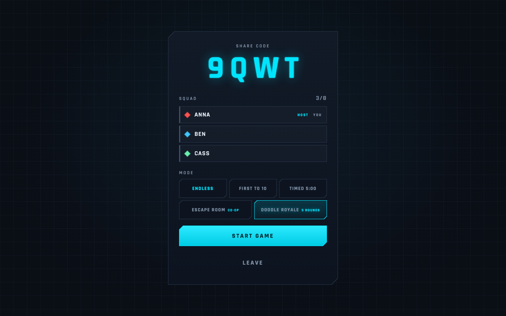
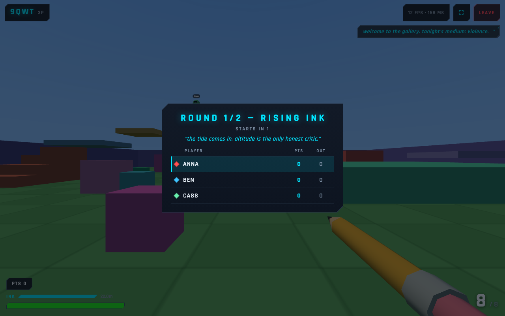
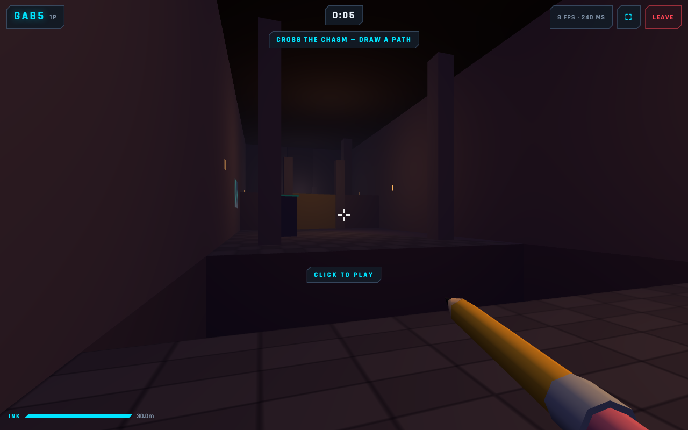
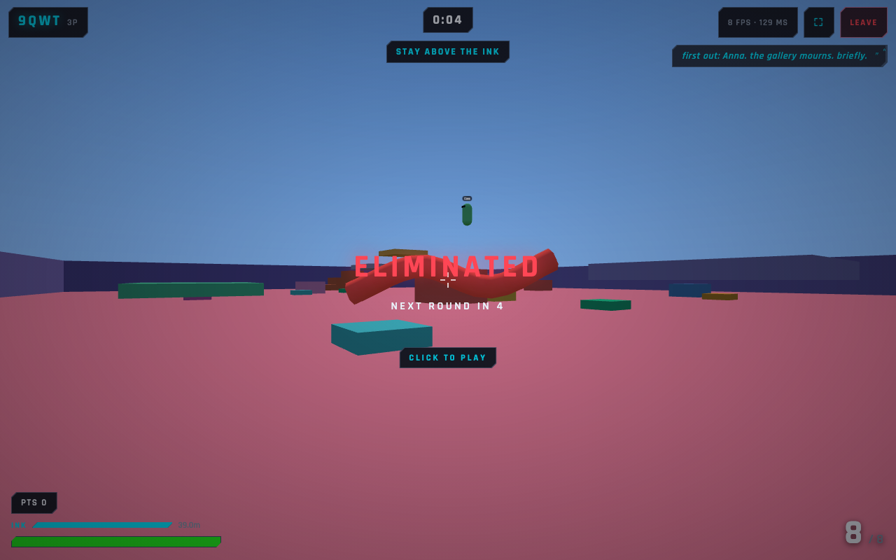

# BoomBoom — Doodle Royale

*Draw it. Climb it. Survive it.*

[](./LICENSE)

BoomBoom is a free, open-source, LAN-first 3D multiplayer game for browsers. Create a room, share its code, then turn sketches into solid, walkable magic ink while you battle, solve a co-op dungeon, or survive a five-round Doodle Royale.

<p align="center">
  
  
</p>
<p align="center">
  
  
</p>

## Features

- **Drawings become level geometry.** Cast bridges, ramps, cover, platforms, barriers, or an ink elevator that every player can see and use.
- **Five modes.** Three pencil-shooter formats, the co-op Doodle Dungeon, and Doodle Royale's rotating party minigames.
- **Room-code multiplayer for up to eight players.** Play from laptops, tablets, and phones on the same trusted network.
- **Server-authoritative matches.** Health, kills, respawns, ink budgets, drawing validation, and match flow live on the server.
- **Desktop and touch controls.** Mobile landscape/fullscreen support and an in-game FPS/ping readout are included.

## Quick start

Requires Node.js 20.19+ (or 22.12+) and npm.

1. Install dependencies: `npm install`
2. Start the client and server: `npm run dev`
3. Open [http://localhost:5173](http://localhost:5173)

The development command runs Express + Socket.IO at `http://localhost:3001` and Vite at `http://localhost:5173`. Vite proxies `/socket.io`, including WebSockets, to the server.

### Play on phones over LAN

Vite runs with `--host` and prints a **Network** URL such as `http://192.168.x.x:5173`. Open that URL on another laptop, phone, or tablet connected to the same Wi-Fi. The socket connection uses the same Vite proxy, so no client configuration is needed.

## Controls

- **Desktop:** WASD to move, mouse to look, click to lock the pointer, left-click to fire, **R** to reload, **Space** to jump/double-jump, **Q** to draw, hold **G** to erase your ink, and hold **Tab** for the scoreboard.
- **Desktop sketching:** hold left-click to draw on the floating plane; **Enter/Q** casts, **Backspace** undoes a stroke, and **Esc** cancels. WASD still works while sketching.
- **Mobile:** use the left joystick to move and drag the right side to look. FIRE, RELOAD, DRAW, ERASE, CAST, UNDO, and CANCEL are on-screen. Tap the room-code badge for scores; landscape and fullscreen are supported where available.

## Magic ink

Aim, press **Q / DRAW**, sketch up to six strokes, and cast. The drawing appears in your player color as solid shared geometry: walk on it, hide behind it, block a route, or draw under your feet to rise.

- Combat modes provide a regenerating 12m stroke budget; Escape Room provides 30m.
- Erasing your own ink refunds its cost.
- Combat drawings fade after 30 seconds; dungeon drawings are permanent.
- The server validates budgets, bounds, and caps, with at most 40 drawings per room.

## Game modes

The host chooses one of five modes before starting:

1. **Endless** — open-ended free play and the default combat mode.
2. **First to 10** — the first player to ten eliminations wins.
3. **Timed 5:00** — the highest kill count after five minutes wins.
4. **Escape Room** — a weapon-free co-op run through the Doodle Dungeon.
5. **Doodle Royale** — five short rounds of drawing-powered party games.

The combat pencil is hitscan: 20 damage, 100 HP, an eight-round magazine, a 1.2s reload, 250ms between shots, and a 3s respawn. Matches include hit markers, kill feed, damage/death feedback, final scores, and an automatic return to the lobby.

### Escape Room: The Doodle Dungeon

Race the clock through three collaborative drawing puzzles:

1. Bridge an 8m chasm that cannot be cleared by double-jumping.
2. Reach and weigh down a pressure plate on a 3m pillar.
3. Copy the glowing key mural near the sealed door; a $P recognizer checks the shape with free retries.

Cross the final doorway to stop the timer and record the team's escape time.

### Doodle Royale

Each round opens with live standings and commentary from **The Critic**, then selects a minigame:

- **Rising Ink** — draw upward before the flood catches you.
- **Draw Duel** — one-hit pencil duels with scarce ink and decaying drawings in sudden death.
- **Floor Check** — get onto a crate, platform, or doodle before the floor-check pulse; guns unlock later in the round.

The fifth round is a faster rising-ink finale with double points, a 30m ink pool, and longer-lived drawings. Later eliminations score more, survivors and winners earn bonuses, and eliminated players spectate until the next round. Shooting enemy drawings refunds up to 4m of ink; the last-place player receives extra ink from round two onward. A cinematic podium crowns the champion, and **SAVE THE ART** downloads a PNG of the final scene.

## Tech stack and architecture

- **Client:** TypeScript, Three.js, and Vite.
- **Server:** Node.js, Express, Socket.IO, and `tsx`.
- **Shared:** socket protocol types and gameplay constants imported by both workspaces.
- **Networking:** room state and player movement are relayed over Socket.IO; health, scoring, ink, and mode directors are server-authoritative.

In development, Vite serves the client and proxies sockets to the server. In production, Express serves the compiled client and the socket endpoint from one port.

## Production mode

```bash
npm run build
npm start
```

The server detects `client/dist` and serves it at `http://localhost:3001`. Other devices on the LAN can use `http://<host-ip>:3001`.

## Tests

Run the checks relevant to your change:

- `npm run typecheck` — type-check both workspaces.
- `npm run test:controller` — jump and double-jump controller tests; no server required.
- `npm run test:ink` — RDP stroke simplification and $P key recognition; no server required.
- `npm run e2e:socket` — room protocol, combat, drawing, Escape Room, and Doodle Royale against a running server.
- `npm run e2e:browser` — two-browser UI, WebGL, drawing sync, mobile UI, and all five modes against a running app.

Install Chromium once before the browser suite:

```bash
npx playwright install chromium
```

### BOOM_* test knobs

The server and the socket test must receive the same shortened values:

- `BOOM_MATCH_TIME_MS` — timed-match length in milliseconds (default `300000`).
- `BOOM_RESET_DELAY_MS` — regular post-match scoreboard/reset delay (default `7000`).
- `BOOM_PARTY_ROUNDS` — Doodle Royale round count (default `5`).
- `BOOM_PARTY_INTERMISSION_MS` — round-card length (default `8000`).
- `BOOM_PARTY_ROUND_MS` — overrides every party round; grace periods and in-round events scale with it.
- `BOOM_PARTY_PODIUM_MS` — podium and party reset length (default `14000`).
- `BOOM_PARTY_FORCE_KIND` — comma-separated `rising-ink`, `draw-duel`, or `floor-check` schedule; the last value repeats.

Example socket run:

```bash
# Terminal 1
PORT=3102 BOOM_MATCH_TIME_MS=2000 BOOM_RESET_DELAY_MS=600 \
  BOOM_PARTY_ROUNDS=2 BOOM_PARTY_INTERMISSION_MS=1500 \
  BOOM_PARTY_ROUND_MS=6000 BOOM_PARTY_PODIUM_MS=2000 \
  BOOM_PARTY_FORCE_KIND=rising-ink,draw-duel npm start

# Terminal 2
SERVER_URL=http://localhost:3102 BOOM_MATCH_TIME_MS=2000 BOOM_RESET_DELAY_MS=600 \
  BOOM_PARTY_ROUNDS=2 BOOM_PARTY_INTERMISSION_MS=1500 \
  BOOM_PARTY_ROUND_MS=6000 BOOM_PARTY_PODIUM_MS=2000 \
  BOOM_PARTY_FORCE_KIND=rising-ink,draw-duel npm run e2e:socket
```

Without short match timers, the socket suite skips its real five-minute timed-mode check. The browser suite expects the default match timers, but its party section still needs matching `BOOM_PARTY_*` values on the server and test. See [e2e/README.md](./e2e/README.md) for exact launch recipes and coverage. Pointer lock and touch input require manual checks.

## Project structure

- `client/` — Vite + TypeScript + Three.js front end (npm workspace).
- `server/` — Express + Socket.IO game server (npm workspace).
- `shared/` — protocol types and gameplay constants shared by both sides.
- `e2e/` — socket and Playwright browser suites.
- `docs/screenshots/` — public README and release screenshots.

## Contributing

Contributions are welcome. Keep changes focused, run the relevant type checks/tests, and describe player-visible behavior clearly in the pull request.

## Known limitations

- BoomBoom is LAN-first and has no hosted public demo. Self-host it on a trusted local network; the server is not hardened for direct internet exposure.
- Vite reports a JavaScript chunk larger than 500 kB because Three.js is bundled into one client chunk (about 180 kB gzipped). This is expected for the current LAN-focused build.

## License

[MIT](./LICENSE) © 2026 [Daksh Mor](https://github.com/daksh-mor).
